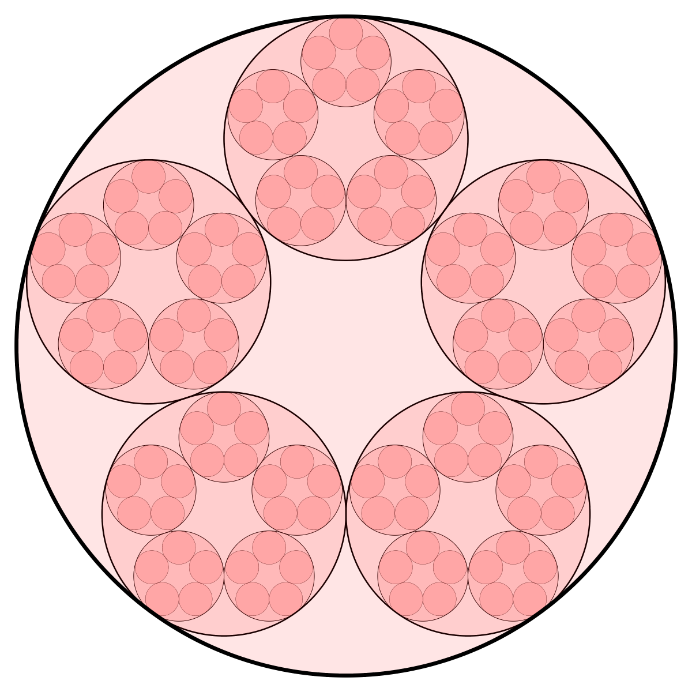

# p-adic-diagrams

This simple program creates diagrams of [p-adic](https://en.wikipedia.org/wiki/P-adic_number) integers. All configuration is done in the source file `src/Main.hs`. Program is conceived as most hackable as possible. 

## Building

Bulid with cabal by running `cabal build` (or `cabal new-build`) inside repo.

## Usage

Run  `p-adic-diagrams -o OUTPUT -w WIDTH P DEPTH`, where `P` and `DEPTH` are positive integers, `WIDTH` is desired width of the output image and `OUTPUT` is name of output file. All parametars are mandatory.

### Example

Following comand generate 1000x1000 diagram of *Z*<sub>5</sub> with 4 levels.

```
p-adic-diagrams -o Z5.png -w 1000 5 4
```

<p align="center">
 
</p>


## SVG output

See comment on line 11 in `Main.hs`.

## Examples 

<p align="center">
  
</p>

*Note gap in the last image. It is easy to make adjusments like this by simple modification of code.*

## Credits

Author of program is [Nikola Ubavić](https://ubavic.rs/?lang=en).

## License

See the [LICENSE](LICENSE) file for details.